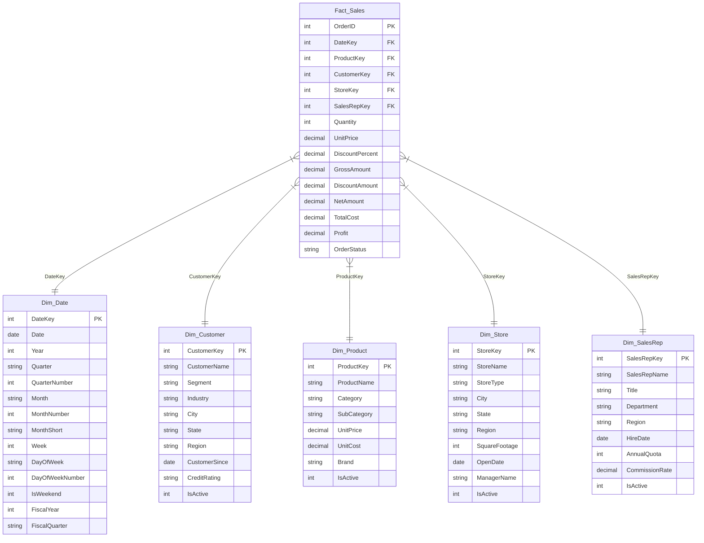

# Sales Dashboard — Semantic Model Documentation

> **Report:** Sales-Dashboard  
> **Format:** PBIR (Visual Schema 2.7.0)  
> **Last Updated:** 2026-04-13  
> **Audience:** Board / Executive Leadership  
> **Purpose:** Sales performance analysis by region, product, store, and time period

---

## Table of Contents

1. [Model Overview](#model-overview)
2. [Data Model Diagram](#data-model-diagram)
3. [Data Dictionary](#data-dictionary)
4. [Measure Reference](#measure-reference)
5. [Data Sources](#data-sources)
6. [Report Pages](#report-pages)

---

## Model Overview

| Property | Value |
|----------|-------|
| Schema | Star Schema |
| Fact Tables | 1 (Fact_Sales) |
| Dimension Tables | 5 (Dim_Date, Dim_Customer, Dim_Product, Dim_Store, Dim_SalesRep) |
| Measure Table | 1 (_Measures — 15 measures) |
| Total Rows | ~10,000 orders |
| Relationships | 5 active (all single-direction, many-to-one) |
| Date Range | 2024–2025 |
| Refresh Mode | Import |

---

## Data Model Diagram



**Relationship Summary:**

| From (Many) | To (One) | Join Column | Direction | Status |
|-------------|----------|-------------|-----------|--------|
| Fact_Sales | Dim_Date | DateKey | Single | Active |
| Fact_Sales | Dim_Customer | CustomerKey | Single | Active |
| Fact_Sales | Dim_Product | ProductKey | Single | Active |
| Fact_Sales | Dim_Store | StoreKey | Single | Active |
| Fact_Sales | Dim_SalesRep | SalesRepKey | Single | Active |

All relationships are single-direction (dimension filters fact). No bi-directional or many-to-many relationships exist.

---

## Data Dictionary

### Fact_Sales

The central fact table containing one row per sales order. All monetary amounts are in USD.

| Column | Data Type | Description | Example Values |
|--------|-----------|-------------|----------------|
| OrderID | Integer | Unique order identifier (PK) | 1, 2, ... 10000 |
| DateKey | Integer | Foreign key to Dim_Date (YYYYMMDD format) | 20240115, 20250301 |
| ProductKey | Integer | Foreign key to Dim_Product | 1–52 |
| CustomerKey | Integer | Foreign key to Dim_Customer | 1–200 |
| StoreKey | Integer | Foreign key to Dim_Store | 1–20 |
| SalesRepKey | Integer | Foreign key to Dim_SalesRep | 1–30 |
| Quantity | Integer | Units sold in the order | 1–10 |
| UnitPrice | Decimal | Price per unit at time of sale | $5–$1,800 |
| DiscountPercent | Decimal | Discount rate applied (0.0–0.25) | 0.00, 0.10, 0.25 |
| GrossAmount | Decimal | Pre-discount total (Quantity x UnitPrice) | — |
| DiscountAmount | Decimal | Dollar value of discount (Gross x Discount%) | — |
| NetAmount | Decimal | Revenue after discount (Gross - Discount) | — |
| TotalCost | Decimal | Cost of goods sold for the order | — |
| Profit | Decimal | Net profit (NetAmount - TotalCost). Can be negative. | — |
| OrderStatus | String | Fulfillment status | Completed, Shipped, Processing, Cancelled, Returned |

### Dim_Date

Calendar dimension supporting time-based analysis and YoY comparisons.

| Column | Data Type | Description | Example Values |
|--------|-----------|-------------|----------------|
| DateKey | Integer | Primary key (YYYYMMDD format) | 20240101 |
| Date | Date | Full date value | January 1, 2024 |
| Year | Integer | Calendar year | 2024, 2025 |
| Quarter | String | Quarter label | Q1, Q2, Q3, Q4 |
| QuarterNumber | Integer | Numeric quarter for sorting | 1–4 |
| Month | String | Full month name | January, February |
| MonthNumber | Integer | Numeric month for sorting | 1–12 |
| MonthShort | String | Three-letter abbreviation | Jan, Feb, Mar |
| Week | Integer | Week of year | 1–53 |
| DayOfWeek | String | Day name | Monday, Tuesday |
| DayOfWeekNumber | Integer | Numeric day (1=Mon, 7=Sun) | 1–7 |
| IsWeekend | Integer | Weekend flag (1=Sat/Sun, 0=Weekday) | 0, 1 |
| FiscalYear | Integer | Fiscal year designation | 2023, 2024 |
| FiscalQuarter | String | Fiscal quarter label | FQ1, FQ2, FQ3, FQ4 |

### Dim_Customer

Customer dimension with geographic and segmentation attributes.

| Column | Data Type | Description | Example Values |
|--------|-----------|-------------|----------------|
| CustomerKey | Integer | Primary key | 1–200 |
| CustomerName | String | Full customer name | — |
| Segment | String | Business segment | Consumer, Small Business, Mid-Market, Enterprise |
| Industry | String | Industry vertical | Government, Manufacturing, Finance, Technology, Healthcare, Retail, Education |
| City | String | Customer city | — |
| State | String | Two-letter state code | CA, TX, NY |
| Region | String | Geographic sales region | West, Central, East, South |
| CustomerSince | Date | Date customer was acquired | 2018–2024 |
| CreditRating | String | Credit tier | A (best), B (standard), C (risk) |
| IsActive | Integer | Active flag (1=active, 0=inactive) | ~90% active |

### Dim_Product

Product catalog with category hierarchy and pricing.

| Column | Data Type | Description | Example Values |
|--------|-----------|-------------|----------------|
| ProductKey | Integer | Primary key | 1–52 |
| ProductName | String | Product display name | Gaming Laptop X, Standing Desk 60 |
| Category | String | Top-level grouping | Electronics, Office Supplies, Furniture, Breakroom, Software |
| SubCategory | String | Second-level grouping | Laptops, Phones, Desks, Chairs, Printers |
| UnitPrice | Decimal | Current list price (USD) | $5–$1,800 |
| UnitCost | Decimal | Cost of goods per unit (USD) | — |
| Brand | String | Product brand | AlphaCore, BetaTech, DeltaWorks, EpsilonEdge, GammaGear |
| IsActive | Integer | Active flag | All 52 products currently active |

### Dim_Store

Store locations with geographic and operational attributes.

| Column | Data Type | Description | Example Values |
|--------|-----------|-------------|----------------|
| StoreKey | Integer | Primary key | 1–20 |
| StoreName | String | Store display name | Miami Standard, Boston Warehouse |
| StoreType | String | Store format | Warehouse, Standard, Express, Flagship |
| City | String | Store city | — |
| State | String | Two-letter state code | — |
| Region | String | Geographic sales region | West, Central, East, South |
| SquareFootage | Integer | Physical store size (sq ft) | 2,000–15,000 |
| OpenDate | Date | Store opening date | 2016–2023 |
| ManagerName | String | Current store manager | — |
| IsActive | Integer | Active flag | All 20 stores currently active |

### Dim_SalesRep

Sales team dimension with role and compensation attributes.

| Column | Data Type | Description | Example Values |
|--------|-----------|-------------|----------------|
| SalesRepKey | Integer | Primary key | 1–30 |
| SalesRepName | String | Full name | — |
| Title | String | Job title | Sales Representative, Senior Sales Rep, Account Executive, Sales Manager |
| Department | String | Sales department | Enterprise Sales, Inside Sales, Field Sales |
| Region | String | Territory region | West, Central, East, South |
| HireDate | Date | Date hired | 2019–2024 |
| AnnualQuota | Integer | Revenue target (USD) | $250K, $500K, $750K, $1M, $1.5M |
| CommissionRate | Decimal | Commission percentage | 3.1%–7.7% |
| IsActive | Integer | Active flag (24 active, 6 inactive) | 0, 1 |

---

## Measure Reference

All measures reside in the `_Measures` table, organized into display folders.

### Revenue Measures

#### Total Revenue

| Property | Value |
|----------|-------|
| Display Folder | Revenue |
| Format | $#,0 |
| DAX | `SUM(Fact_Sales[NetAmount])` |

**Business Logic:** Calculates total net sales revenue after discounts across all orders. This is the primary top-line KPI used in executive reporting. It sums the `NetAmount` column, which represents the final revenue after discount deductions.

---

#### Total Profit

| Property | Value |
|----------|-------|
| Display Folder | Revenue |
| Format | $#,0 |
| DAX | `SUM(Fact_Sales[Profit])` |

**Business Logic:** Calculates total bottom-line profit across all orders. Profit is computed as net revenue minus cost of goods sold. This is the key profitability indicator for Board and Executive review.

---

#### Profit Margin %

| Property | Value |
|----------|-------|
| Display Folder | Revenue |
| Format | 0.0% |
| DAX | `DIVIDE([Total Profit], [Total Revenue])` |

**Business Logic:** Expresses profit as a percentage of net revenue. Uses `DIVIDE` for safe division, returning BLANK if revenue is zero. Indicates overall pricing efficiency and cost management. A declining margin may signal rising costs or excessive discounting.

---

#### Total Gross

| Property | Value |
|----------|-------|
| Display Folder | Revenue |
| Format | $#,0 |
| DAX | `SUM(Fact_Sales[GrossAmount])` |

**Business Logic:** Calculates total sales at full list price before any discounts. Comparing Total Gross to Total Revenue reveals the dollar impact of discounting strategies.

---

### Volume Measures

#### Total Orders

| Property | Value |
|----------|-------|
| Display Folder | Volume |
| Format | #,0 |
| DAX | `DISTINCTCOUNT(Fact_Sales[OrderID])` |

**Business Logic:** Counts the number of unique sales orders. Uses `DISTINCTCOUNT` to avoid double-counting if the model evolves to include line-item-level detail. Measures transaction volume independent of order size.

---

#### Total Quantity

| Property | Value |
|----------|-------|
| Display Folder | Volume |
| Format | #,0 |
| DAX | `SUM(Fact_Sales[Quantity])` |

**Business Logic:** Total physical units sold across all orders. Measures sales volume independent of pricing or revenue. Useful for supply chain and inventory planning context.

---

#### Avg Order Value

| Property | Value |
|----------|-------|
| Display Folder | Volume |
| Format | $#,0 |
| DAX | `DIVIDE([Total Revenue], [Total Orders])` |

**Business Logic:** Average revenue generated per order. Tracks whether order size is growing or shrinking over time. A declining AOV alongside growing order count may indicate a shift toward lower-value products.

---

### Discount Measures

#### Total Discount

| Property | Value |
|----------|-------|
| Display Folder | Discounts |
| Format | $#,0 |
| DAX | `SUM(Fact_Sales[DiscountAmount])` |

**Business Logic:** Total dollar value of discounts given across all orders. Tracks the cost of promotional and volume discounting strategies. Rising discount dollars should be monitored against revenue growth to ensure net-positive ROI.

---

#### Discount Rate %

| Property | Value |
|----------|-------|
| Display Folder | Discounts |
| Format | 0.0% |
| DAX | `DIVIDE([Total Discount], [Total Gross])` |

**Business Logic:** Discount as a percentage of gross (pre-discount) sales. Measures how aggressively discounts are being applied. A rising rate over time may signal margin erosion or over-reliance on promotional pricing.

---

### Trend Measures

#### Revenue YoY %

| Property | Value |
|----------|-------|
| Display Folder | Trends |
| Format | 0.0% |
| DAX | |

```dax
VAR CY = [Total Revenue]
VAR CurrentYear = MAX(Dim_Date[Year])
VAR PY = CALCULATE(
    [Total Revenue],
    FILTER(ALL(Dim_Date), Dim_Date[Year] = CurrentYear - 1)
)
RETURN
    IF(HASONEVALUE(Dim_Date[Year]) && PY, DIVIDE(CY - PY, PY))
```

**Business Logic:** Year-over-year percentage change in revenue. Compares the current year's revenue to the prior year. The `HASONEVALUE` guard ensures this measure returns BLANK when multiple years are selected (e.g., slicer set to "All"), preventing misleading cross-year comparisons at the grand total level. A positive value indicates revenue growth; negative indicates decline.

---

#### Profit YoY %

| Property | Value |
|----------|-------|
| Display Folder | Trends |
| Format | 0.0% |
| DAX | |

```dax
VAR CY = [Total Profit]
VAR CurrentYear = MAX(Dim_Date[Year])
VAR PY = CALCULATE(
    [Total Profit],
    FILTER(ALL(Dim_Date), Dim_Date[Year] = CurrentYear - 1)
)
RETURN
    IF(HASONEVALUE(Dim_Date[Year]) && PY, DIVIDE(CY - PY, PY))
```

**Business Logic:** Year-over-year percentage change in profit. Same pattern as Revenue YoY % but applied to the bottom line. The `HASONEVALUE` guard prevents misleading grand total comparisons. Comparing Revenue YoY % alongside Profit YoY % reveals whether growth is translating to the bottom line.

---

### Ranking Measures

#### Revenue Rank (Region)

| Property | Value |
|----------|-------|
| Display Folder | Rankings |
| Format | #,0 |
| DAX | `IF(HASONEVALUE(Dim_Customer[Region]), RANKX(ALL(Dim_Customer[Region]), [Total Revenue], , DESC, Dense))` |

**Business Logic:** Ranks geographic regions by total revenue (1 = highest). Uses Dense ranking so tied regions share the same rank. Returns BLANK at aggregate level to prevent misleading total-row rankings. Enables quick identification of best and worst performing regions.

---

#### Revenue Rank (Store)

| Property | Value |
|----------|-------|
| Display Folder | Rankings |
| Format | #,0 |
| DAX | `IF(HASONEVALUE(Dim_Store[StoreName]), RANKX(ALL(Dim_Store[StoreName]), [Total Revenue], , DESC, Dense))` |

**Business Logic:** Ranks store locations by total revenue (1 = highest). Supports identification of top and bottom performing stores for operational review and resource allocation decisions.

---

#### Revenue Rank (Product)

| Property | Value |
|----------|-------|
| Display Folder | Rankings |
| Format | #,0 |
| DAX | `IF(HASONEVALUE(Dim_Product[ProductName]), RANKX(ALL(Dim_Product[ProductName]), [Total Revenue], , DESC, Dense))` |

**Business Logic:** Ranks products by total revenue (1 = highest). Supports Top N product analysis for executive reporting. Used in conjunction with visual-level TopN filters to show the top 10 revenue-generating products.

---

#### Profit Rank (Product)

| Property | Value |
|----------|-------|
| Display Folder | Rankings |
| Format | #,0 |
| DAX | `IF(HASONEVALUE(Dim_Product[ProductName]), RANKX(ALL(Dim_Product[ProductName]), [Total Profit], , DESC, Dense))` |

**Business Logic:** Ranks products by total profit (1 = highest). Highlights products with the best margin contribution versus pure revenue volume. Comparing revenue rank to profit rank for the same product reveals margin efficiency — a product ranked high in revenue but low in profit may warrant pricing review.

---

## Data Sources

All data is sourced from CSV files loaded via Power Query (M language) in Import mode.

### Source Files

| Table | Source File | Delimiter | Encoding | Columns |
|-------|-----------|-----------|----------|---------|
| Fact_Sales | `Fact_Sales.csv` | Comma | 1252 (Windows) | 15 |
| Dim_Date | `Dim_Date.csv` | Comma | 1252 (Windows) | 14 |
| Dim_Customer | `Dim_Customer.csv` | Comma | 1252 (Windows) | 10 |
| Dim_Product | `Dim_Product.csv` | Comma | 1252 (Windows) | 8 |
| Dim_Store | `Dim_Store.csv` | Comma | 1252 (Windows) | 10 |
| Dim_SalesRep | `Dim_SalesRep.csv` | Comma | 1252 (Windows) | 9 |

**Source Directory:** `C:\Users\jchoi\OneDrive\Desktop\Claude Code\PBI Projects\Sales-Dashboard\`

### Power Query Transformation Steps

Each table follows the same three-step ETL pattern:

| Step | Operation | Description |
|------|-----------|-------------|
| 1 | `Csv.Document(File.Contents(...))` | Load raw CSV file from local path |
| 2 | `Table.PromoteHeaders` | Promote first row to column headers |
| 3 | `Table.TransformColumnTypes` | Apply explicit data types to all columns |

**Type Mappings Applied:**

| Source Type | Power Query Type | Applied To |
|-------------|-----------------|------------|
| Integer keys | `Int64.Type` | All PK/FK columns, Year, QuarterNumber, MonthNumber, etc. |
| Text fields | `type text` | Names, categories, regions, statuses |
| Dates | `type date` | Date, CustomerSince, HireDate, OpenDate |
| Decimals | `type number` | UnitPrice, UnitCost, CommissionRate, all monetary amounts |

**Notes:**
- No advanced transformations (merges, pivots, custom columns) are applied — all business logic resides in DAX measures
- The CSV source paths are absolute local paths; these will need updating if the project is migrated to a different machine or to a cloud data source (e.g., SharePoint, Azure Blob, Databricks)
- Encoding 1252 (Windows Latin-1) handles standard ASCII and Western European characters

---

## Report Pages

### Page 1: Sales Overview

**Purpose:** Executive summary of sales performance across time, region, and order status.

| Visual | Type | Measures / Fields |
|--------|------|-------------------|
| Header | Shape + Textbox | "Sales Overview" |
| Year Slicer | Dropdown | Dim_Date[Year] |
| Region Slicer | Dropdown | Dim_Customer[Region] |
| KPI Cards (7) | Card | Total Revenue, Total Profit, Profit Margin %, Total Orders, Avg Order Value, Revenue YoY %, Profit YoY % |
| Monthly Trend | Line Chart | Axis: MonthShort, Values: Total Revenue, Legend: Year |
| Revenue by Region | Bar Chart | Axis: Region, Values: Total Revenue |
| Quarterly Revenue & Profit | Bar Chart | Axis: Quarter, Values: Total Revenue + Total Profit |
| Orders by Status | Donut Chart | Legend: OrderStatus, Values: Total Orders |
| Bottom Cards (2) | Card | Total Quantity, Total Discount |

### Page 2: Product & Store Performance

**Purpose:** Drill-down into product-level and store-level performance for operational decisions.

| Visual | Type | Measures / Fields |
|--------|------|-------------------|
| Header | Shape + Textbox | "Product & Store Performance" |
| Year Slicer | Dropdown | Dim_Date[Year] |
| Category Slicer | Dropdown | Dim_Product[Category] |
| KPI Cards (4) | Card | Total Revenue, Total Profit, Profit Margin %, Discount Rate % |
| Top 10 Products | Bar Chart | Axis: ProductName, Values: Total Revenue (TopN filter) |
| Bottom 10 Products | Bar Chart | Axis: ProductName, Values: Total Profit (TopN filter) |
| Category Comparison | Column Chart | Axis: Category, Values: Total Revenue + Total Profit |
| Revenue by Store | Bar Chart | Axis: StoreName, Values: Total Revenue |
| Product Matrix | Matrix | Rows: Category > SubCategory, Values: Total Revenue, Total Profit, Profit Margin % |

---
